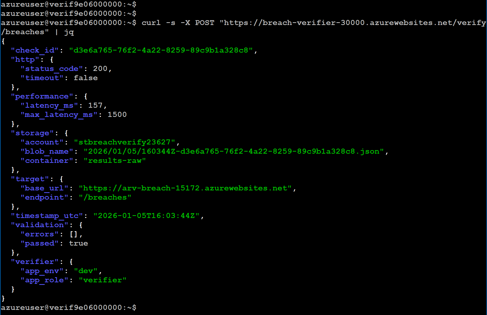
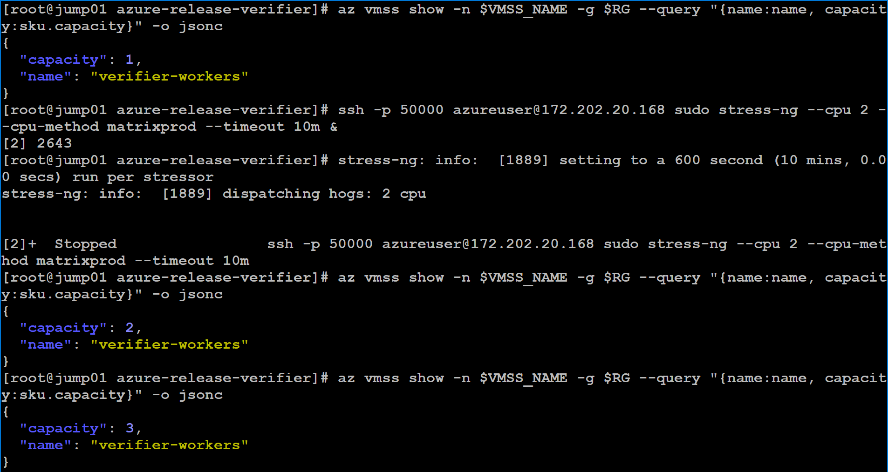
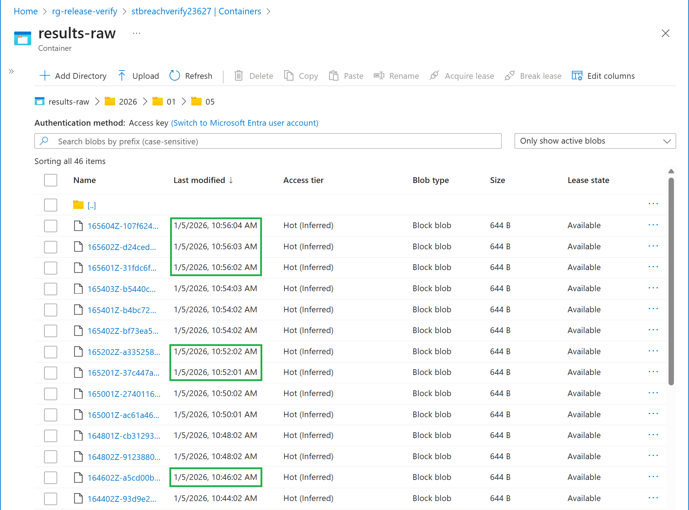
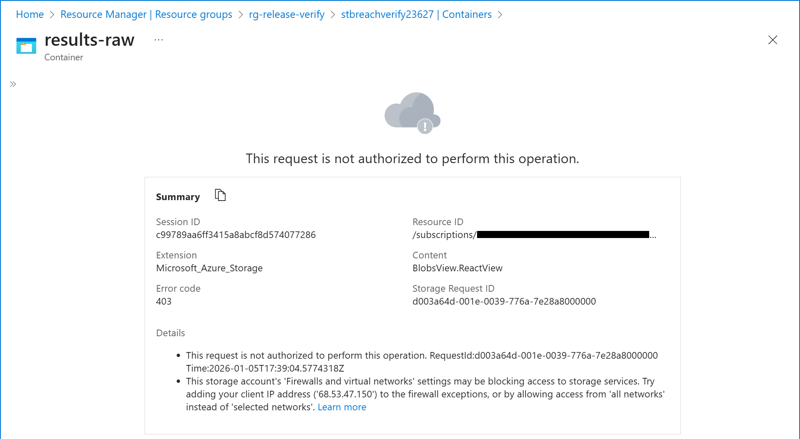

# Azure Release Verification Platform  

## Overview

This project implements a **realistic, enterprise-grade release verification platform** on Microsoft Azure. The platform is designed to validate the health, correctness, and performance of an internal application after deployment using automated verification, scalable execution, and audit-ready evidence.

>This project intentionally focuses on verification correctness, scalability, and security. Alerting, dashboards, and CI/CD integration are considered follow-on enhancements and are out of scope for the initial platform.

## High-Level Purpose

The platform enables infrastructure and platform teams to:

- Deploy and operate an internal web API
- Continuously verify service availability and correctness
- Measure performance characteristics (latency)
- Scale verification workloads under demand
- Securely store verification evidence
- Enforce least-privilege access and network isolation
- Provide audit-ready proof of operational correctness

## Why This Pattern Matters

This platform demonstrates how verification, not deployment, is the final gate for production readiness.

Rather than assuming a release is healthy based on deployment success, this design validates:
- Runtime behavior
- Performance thresholds
- Horizontal scalability
- Secure evidence retention

This pattern mirrors how mature platform teams reduce risk during releases while maintaining auditability and operational clarity.

## Architecture Overview

### Core Components

1. **Target Application (Azure App Service – Linux)**  
   Internal API under validation, exposing health, readiness, and data endpoints required for release verification.

2. **Verifier Service (Azure App Service – Linux, Containerized)**  
   Control-plane service responsible for executing validation logic, measuring performance, and writing immutable verification evidence.

3. **Execution Layer (Azure Virtual Machine Scale Set)**  
   Horizontally scalable worker pool that triggers verification requests during release activity.

4. **Evidence Storage (Azure Blob Storage)**  
   Immutable system of record for verification results, accessed exclusively via Private Endpoint and RBAC.

5. **Networking (Azure Virtual Network)**  
   Private subnets, Private Endpoints, DNS integration, and access restrictions enforcing internal-only communication.

6. **Identity & Access Control (Microsoft Entra ID)**  
   Managed identities and role-based access control enforcing least privilege and separation of duties.


## Target Application

### Purpose
The target application represents an **internal Security Intelligence API** that aggregates breach data from Have I Been Pwned (HIBP).

### Platform
- Azure App Service (Linux)
- Python 3.11
- Flask + gunicorn
- Deployed via Azure CLI (ZIP deploy)

### Endpoints

| Endpoint | Purpose |
|--------|---------|
| `/health` | Liveness check |
| `/ready` | Readiness based on cache/API availability |
| `/version` | Application metadata |
| `/breaches` | Fetches and caches breach data |

### Design Notes
- In-memory TTL cache (default 30 minutes)
- Graceful degradation using stale cache
- Explicit production startup command
- No secrets stored in code

### Enterprise Realism
- Mirrors internal wrapper APIs used by security teams
- Exposes operational endpoints required for verification

## Verifier Service

### Purpose
The Verifier is a **dedicated control-plane service** responsible for validating the target application and producing structured verification evidence.

### Platform
- Azure App Service (Linux, containerized)
- Container image stored in Azure Container Registry (ACR)
- System-assigned Managed Identity

### Responsibilities
- Call the target `/breaches` endpoint
- Validate:
  - HTTP status
  - JSON response
  - latency threshold
- Generate structured evidence
- Write evidence to Azure Blob Storage
- Return pass/fail status to the caller

  

  <div align=center>
     <em>
        The verifier validates the target endpoint, measures latency, generates a unique check ID, and returns structured pass/fail results while writing immutable evidence to Blob Storage.
     </em>
  </div>
  
### Key Design Decisions
- Verifier is **stateless**
- Workers do not write to storage directly
- Evidence format is consistent and centralized
- No secrets, keys, or connection strings used

### Storage Access
- RBAC-based data-plane permissions
- Writes only to `results-raw/`

## Evidence Storage (Azure Blob Storage)

### Structure

```bash
results-raw/
└── YYYY/MM/DD/<timestamp>-<check_id>.json
results-summary/
└── (reserved for future rollups)
```

### Security Controls
- Public network access disabled
- HTTPS only, TLS 1.2 enforced
- Access via Private Endpoint
- Private DNS resolution inside the VNet
- RBAC enforced for data-plane access

### Role Separation
- **Writer:** Verifier Managed Identity
- **Readers:** Platform Engineers
- **No deletes or overwrites**

### Purpose
Blob Storage acts as the **system of record** for release verification and audit review.

## Execution Layer

### Platform
- Azure Virtual Machine Scale Set (Uniform)
- Ubuntu Linux
- Autoscaling enabled (1–5 instances)

### Worker Behavior
- Each VM is an independent worker
- Periodically triggers an HTTP POST to `/verify/breaches`
- No local state
- No direct storage access

### Bootstrapping
- VMSS Custom Script Extension
- Script pulled from GitHub
- Installs dependencies
- Creates cron job
- Ensures repeatability on scale-out

### Autoscaling
- CPU-based scaling rules
- Scale-out and scale-in verified using **evidence volume**, not assumptions

  

  <div align=center>
     <em>
        VM Scale Set scaling verified via Azure CLI. CPU stress triggered scale-out from 1 to 3 instances, confirming autoscale rules function as designed.
     </em>
  </div>
  
  <br><br>

  

  <div align=center>
     <em>
        Increased volume of verification evidence written to Blob Storage during VM Scale Set scale-out. Each blob corresponds to an independent worker execution, confirming parallel verification under load.
     </em>
  </div>

### Enterprise Pattern
- Centralized validation logic
- Horizontally scalable execution
- Workers treated as disposable

## Network Security & Isolation

### VNet Design
- Private subnets
- No public exposure for internal services

### Key Controls
- Storage accessed only via Private Endpoint
- Private DNS (`privatelink.blob.core.windows.net`)
- Verifier App Service VNet Integration
- Verifier inbound restricted to VMSS subnet
- External calls receive `403 Forbidden`

  

  <div align=center>
     <em>
       Public network access disabled on the Storage Account, enforcing private-only data-plane access.
     </em>
  </div>
  
  <br><br>
  
  

  <div align=center>
     <em>
        Azure CLI confirmation showing the Storage Account bound to a Private Endpoint, ensuring all storage access occurs within the virtual network.
     </em>
  </div>

### Validation
- Evidence writes succeed only via private path
- Jumpbox/laptop access blocked
- VMSS workers continue to operate normally

## Identity & Access Control

### System Identity

The verifier service uses a **system-assigned Managed Identity** to authenticate to Azure services.

- No secrets, keys, or connection strings are used anywhere in the platform
- Identity-based access is enforced at the data plane
- The verifier identity has write access **only** to the verification evidence container

### Human Access

Human access is restricted to **read-only review** via Microsoft Entra ID group membership.

- **Group:** `Platform-Engineers-Verification-Readers`
- Access is scoped to verification evidence only
- No human principals have write or delete permissions

### RBAC Enforcement

| Scope | Role |
|-----|------|
| Resource Group | Reader |
| Storage Container (`results-raw`) | Storage Blob Data Reader |

### Access Outcomes

Platform Engineers can:
- View platform resources (read-only)
- List and download verification evidence
- Validate release health using stored evidence

They **cannot**:
- Modify infrastructure
- Change verification logic
- Write, overwrite, or delete evidence

### Ownership & Change Control

All changes to infrastructure, verification logic, and security controls are owned by **Cloud / Infrastructure Engineering**.

This includes:
- Application and verifier configuration
- Verification logic and thresholds
- VM Scale Set behavior and autoscaling rules
- Networking, Private Endpoints, and DNS
- RBAC assignments and identity policies


## Operational Workflow

1. Application is deployed
2. VMSS workers trigger verification
3. Verifier validates target behavior
4. Evidence is written to private Blob Storage
5. Platform Engineers review results
6. Release health is confirmed or escalated

## Design Principles

- Infrastructure-first
- Evidence over assumptions
- Least privilege everywhere
- Stateless and scalable components
- No unnecessary services

## Project Status

**Status:** Complete and production-aligned

**Outcome:**  
A secure, scalable, and auditable release verification platform that mirrors real enterprise platform engineering practices.

This project is intentionally designed to **ship as-is**, with optional future enhancements (summaries, alerts, dashboards) clearly separated from core functionality.

